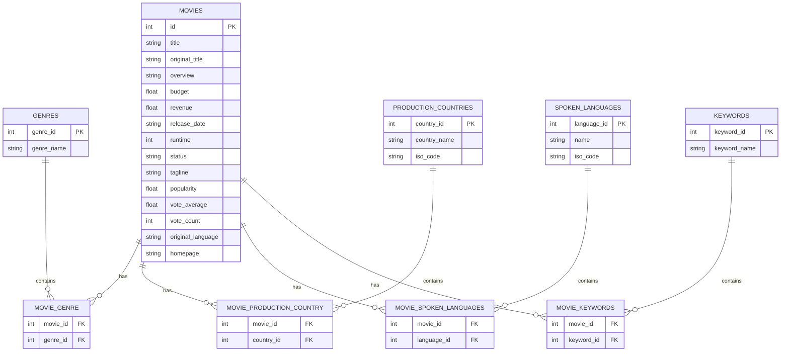

### Movies Table

| Field                 | Description                                                        |
| --------------------- | ------------------------------------------------------------------ |
| **id** (Primary Key)  | A unique identifier for the movie.                                 |
| **title**             | The title of the movie.                                            |
| **original_title**    | The original title of the movie.                                   |
| **overview**          | A brief summary of the movie plot.                                 |
| **budget**            | The budget of the movie.                                           |
| **revenue**           | The total revenue the movie earned.                                |
| **release_date**      | The official release date of the movie.                            |
| **runtime**           | The duration of the movie in minutes.                              |
| **status**            | The current status of the movie (e.g., Released, Post-Production). |
| **tagline**           | A short phrase or slogan associated with the movie.                |
| **popularity**        | A measure of how popular the movie is.                             |
| **vote_average**      | The average rating given to the movie.                             |
| **vote_count**        | The total number of votes the movie received.                      |
| **original_language** | The original language of the movie.                                |
| **homepage**          | The official homepage URL of the movie.                            |

---

### Genres Table

| Field                      | Description                                                |
| -------------------------- | ---------------------------------------------------------- |
| **genre_id** (Primary Key) | Unique identifier for each genre.                          |
| **genre_name**             | The name of the genre (e.g., Action, Drama, Comedy, etc.). |

---

### Movie_Genre Table (Join Table for Many-to-Many Relationship between Movies and Genres)

| Field                      | Description                                                              |
| -------------------------- | ------------------------------------------------------------------------ |
| **movie_id** (Foreign Key) | References the `id` in the Movies table.                                 |
| **genre_id** (Foreign Key) | References the `genre_id` in the Genres table.                           |
| **PRIMARY KEY**            | Composite primary key of `movie_id` and `genre_id` to ensure uniqueness. |

---

### Production_Countries Table

| Field                        | Description                                                       |
| ---------------------------- | ----------------------------------------------------------------- |
| **country_id** (Primary Key) | Unique identifier for each country.                               |
| **country_name**             | The name of the country                                           |
| **iso_code**                 | The ISO 3166-1 alpha-2 country code (e.g. "US" for United States) |

---

### Movie_Production_Countries Table

| Field                        | Description                                                               |
| ---------------------------- | ------------------------------------------------------------------------- |
| **movie_id** (Foreign Key)   | References the `id` in the Movies table.                                  |
| **country_id** (Foreign Key) | References the `country_id` in the Production_Countries table             |
| **PRIMARY KEY**              | Composite primary key of `movie_id` and `country_id` to ensure uniqueness |

---

### Spoken_Languages Table

| Field                         | Description                                                    |
| ----------------------------- | -------------------------------------------------------------- |
| **language_id** (Primary Key) | Unique identifier for each language.                           |
| **name**                      | The name of the language (e.g. "English", "Spanish").          |
| **iso_code**                  | The ISO 639-1 alpha-2 code for the language ("en" for English) |

---

### Movie_Spoken_Languages Table

| Field                         | Description                                                                |
| ----------------------------- | -------------------------------------------------------------------------- |
| **movie_id** (Foreign Key)    | References the `id` in the Movies table                                    |
| **language_id** (Foreign Key) | References the `language_id` in the Spoken_Languages table.                |
| **PRIMARY KEY**               | Composite primary key of `movie_id` and `language_id` to ensure uniqueness |

---

### Keywords Table

| Field                        | Description                                     |
| ---------------------------- | ----------------------------------------------- |
| **keyword_id** (Primary Key) | Unique Identifier for each keyword.             |
| **keyword_name**             | The name of the keyword (e.g., "elf", "knight") |

---

### Movie_Keywords Table

| Field                        | Description                                                               |
| ---------------------------- | ------------------------------------------------------------------------- |
| **movie_id** (Foreign Key)   | References the `id` in the Movies Table                                   |
| **keyword_id** (Foreign Key) | References the `keyword_id` in the Keywords table                         |
| **PRIMARY KEY**              | Composite primary key of `movie_id` and `keyword_id` to ensure uniqueness |

---

### Cast Table

| Field                      | Description                                             |
| -------------------------- | ------------------------------------------------------- |
| **actor_id** (Primary Key) | Unique identifier for each actor                        |
| **name**                   | Name of the actor                                       |
| **gender**                 | Gender of the actor (1 = Female, 2 = Male, 0 = Unknown) |

---

### Movies_Cast Table

| Field                      | Description                                                             |
| -------------------------- | ----------------------------------------------------------------------- |
| **movie_id** (Foreign Key) | References the `id` from the Movies table                               |
| **actor_id** (Foreign Key) | References the `actor_id` from the Cast table                           |
| **character**              | The character played by the actor                                       |
| **PRIMARY KEY**            | Composite primary key of `movie_id` and `actor_id` to ensure uniqueness |

---
